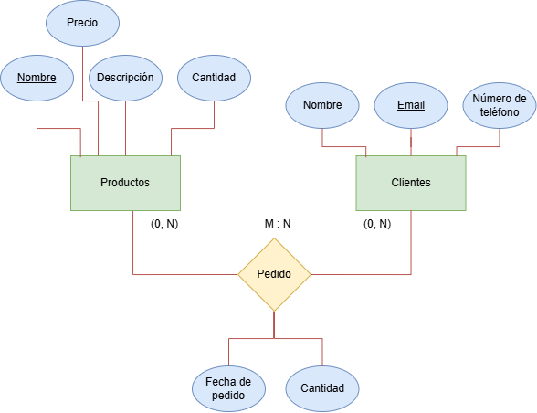
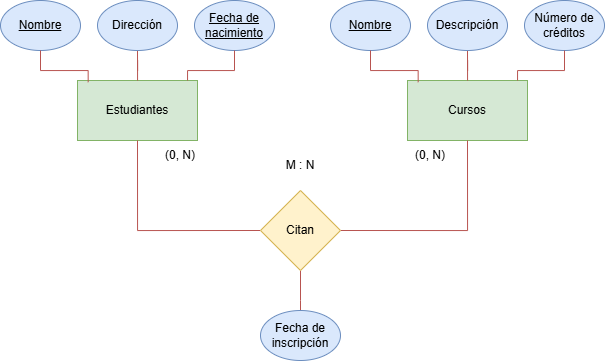

# Practicas diseño BBDD

# Ejercicio 1 - Biblioteca. 
Diseña una base de datos para una biblioteca que permita gestionar los libros y los préstamos.
#

# Ejercicio 2 - Tienda en línea. 
Diseña una base de datos para una tienda en línea que gestione productos,
clientes y pedidos.
#

# Ejercicio 3 - Sistema de gestión escolar
Diseña una base de datos para una escuela que gestione estudiantes, cursos y
matriculaciones.
#

# Ejercicio 4 - Hospital.
Diseña una base de datos para un hospital que gestione pacientes, doctores y citas médicas.
#
